# BINJO (빈조) — Architecture Design

---

## System Overview

```mermaid
graph TB
    subgraph "Customer Facing"
        WEB[Brand Page<br/>Next.js on Vercel]
        KAKAO_LINK[KakaoTalk<br/>Shared Links]
    end

    subgraph "Farmer Facing"
        VOICE[Voice Input<br/>Phone Microphone]
        PHOTO[Photo Input<br/>Camera / Screenshots]
        FARMER_UI[Farmer Dashboard<br/>Mobile Web]
    end

    subgraph "Next.js Frontend (Vercel)"
        PAGES[Pages<br/>Brand + Admin + Farmer]
        API_ROUTES[API Routes<br/>Phase 1 CRUD]
    end

    subgraph "FastAPI Backend (Railway) — Phase 2+"
        API_GW[API Gateway<br/>/api/v1/]
        
        subgraph "Core Modules (CORE_CANDIDATE)"
            AI_ENGINE[AI Engine<br/>LLMProvider]
            STT[Speech-to-Text<br/>Whisper API]
            KAKAO_AUTH[Auth<br/>Kakao OAuth + JWT]
            STORAGE[Storage<br/>R2 File Manager]
            NOTIFY[Notification<br/>Kakao Channel]
            PUB_API[Public API Client<br/>data.go.kr]
            PAYMENT[Payment<br/>TossPayments]
        end

        subgraph "Product Modules"
            FARM_LOG[Farm Log<br/>Voice Pipeline]
            RECEIPT[Receipt OCR<br/>Claude Vision]
            LEDGER[Ledger<br/>Auto Bookkeeping]
            EXPORT[Export<br/>PDF Generator]
            INTEL[Intelligence<br/>AI Reports]
        end
    end

    subgraph "Workers (Celery)"
        VOICE_WORKER[Voice Processing]
        OCR_WORKER[Receipt OCR]
        REPORT_WORKER[Report Generation]
        CLEANUP[Audio Cleanup<br/>30-day TTL]
    end

    subgraph "Data Layer"
        PG[(PostgreSQL)]
        REDIS[(Redis<br/>Celery Broker)]
        R2[(Supabase Storage<br/>Audio + Images)]
    end

    subgraph "External Services"
        WHISPER_API[OpenAI Whisper API]
        CLAUDE_API[Anthropic Claude API]
        KMA[기상청 API]
        TOSS[TossPayments]
        KAKAO_API[Kakao OAuth/Channel]
    end

    WEB --> PAGES
    KAKAO_LINK --> PAGES
    FARMER_UI --> PAGES
    PAGES --> API_ROUTES
    PAGES --> API_GW

    VOICE --> API_GW
    PHOTO --> API_GW

    API_GW --> AI_ENGINE
    API_GW --> STT
    API_GW --> KAKAO_AUTH
    API_GW --> STORAGE
    API_GW --> FARM_LOG
    API_GW --> RECEIPT
    API_GW --> LEDGER
    API_GW --> EXPORT
    API_GW --> INTEL
    API_GW --> PAYMENT

    FARM_LOG --> VOICE_WORKER
    RECEIPT --> OCR_WORKER
    INTEL --> REPORT_WORKER

    VOICE_WORKER --> WHISPER_API
    VOICE_WORKER --> CLAUDE_API
    OCR_WORKER --> CLAUDE_API
    REPORT_WORKER --> CLAUDE_API

    FARM_LOG --> KMA
    PAYMENT --> TOSS
    KAKAO_AUTH --> KAKAO_API
    NOTIFY --> KAKAO_API
    PUB_API --> KMA

    API_GW --> PG
    API_ROUTES --> PG
    VOICE_WORKER --> REDIS
    OCR_WORKER --> REDIS
    STORAGE --> R2
    CLEANUP --> R2
```



---

## Module Breakdown

### Core Modules (Reusable — `app/core/`)

These modules have **no knowledge** of BINJO-specific business logic. They are pure infrastructure.

#### 1. `core/ai/llm_provider.py` — CORE_CANDIDATE
```python
# Abstract LLM interface
# - Supports Claude and OpenAI interchangeably
# - Structured output parsing (JSON mode)
# - Prompt caching for identical requests
# - Timeout + retry with exponential backoff
# - PII redaction in logs
# Reuse: ANY product needing LLM calls
```

#### 2. `core/stt/whisper_api.py` — CORE_CANDIDATE
```python
# OpenAI Whisper API client
# - Audio upload + transcription
# - Language-specific prompt priming (Korean agricultural terms)
# - Post-processing: common mishearing correction dictionary
# - Confidence scoring
# Reuse: Any voice-input product
```

#### 3. `core/auth/kakao_auth.py` — CORE_CANDIDATE
```python
# Kakao OAuth 2.0 flow
# - Authorization URL generation
# - Token exchange
# - User profile retrieval
# - JWT token issuance
# Reuse: Any Korean B2C product
```

#### 4. `core/external_api/public_data.py` — CORE_CANDIDATE
```python
# Korean public data API client (공공데이터포털)
# - API key management
# - Rate limiting
# - Response parsing (XML → JSON, a common pain point)
# - Error handling for government API quirks
# Reuse: Any product using Korean government data
```

#### 5. `core/notification/kakao_channel.py` — CORE_CANDIDATE
```python
# KakaoTalk Channel messaging
# - Alert templates (order notification, task reminder, report ready)
# - Scheduled notifications via Celery
# - Delivery status tracking
# Reuse: Any product targeting Korean users
```

#### 6. `core/storage/file_manager.py` — CORE_CANDIDATE
```python
# S3-compatible file management (Supabase Storage)
# - Upload with automatic format conversion
# - Image optimization (resize, WebP conversion)
# - Presigned URLs for secure access
# - Lifecycle management (auto-delete voice after 30 days)
# Reuse: Any product with media uploads
```

#### 7. `core/payment/toss_provider.py` — CORE_CANDIDATE (Phase 4)
```python
# TossPayments integration
# - Payment widget configuration
# - Server-side payment confirmation
# - Webhook handling
# - Refund processing
# Reuse: Any Korean e-commerce product
```

---

### Product Modules (BINJO-specific — `app/modules/`)

#### `modules/farm_log/`
- `voice_pipeline.py` — Full flow: upload → STT → AI parse → structured data
- `parser_prompt.py` — Claude prompt for Korean agricultural term extraction
- `pdf_exporter.py` — 영농일지 PDF in government-compliant format

#### `modules/receipt/`
- `ocr_pipeline.py` — Receipt photo → Claude Vision → structured transaction
- `nh_screenshot.py` — NH오늘농사 screenshot → OCR → transaction data
- `categorizer.py` — Auto-categorize expenses (AI + rule-based hybrid)

#### `modules/ledger/`
- `transaction_service.py` — CRUD for financial transactions
- `report_generator.py` — Monthly/yearly P&L computation
- `pdf_report.py` — Financial report PDF with charts

#### `modules/order/`
- `checkout_flow.py` — Order creation → payment → confirmation
- `shipping_manager.py` — Track shipping status + notify customer
- `customer_service.py` — Customer analytics + re-engagement

#### `modules/intelligence/`
- `yearly_report.py` — AI-generated annual farm report
- `predictions.py` — Sales predictions based on historical data
- `insights.py` — Cost optimization, customer alerts

---

## Database Schema Overview

### Phase 1 Tables
- `farm` — Farm profile (single row for MVP)
- `product` — Apple varieties with prices
- `seasonal_calendar` — Monthly activities and highlights
- `gallery_photo` — Farm photos
- `review` — Customer reviews
- `order_inquiry` — Click tracking (pre-payment era)

### Phase 2 Tables
- `farmer` — User account (Kakao OAuth)
- `field` — Farm plots/fields (필지)
- `voice_recording` — Audio files and processing status
- `farm_log` — Structured daily entries
- `farm_log_task` — Individual tasks within a log entry
- `chemical_usage` — Pesticide/fertilizer tracking
- `farm_diary_export` — PDF export history

### Phase 3 Tables
- `transaction` — Central financial ledger
- `receipt_scan` — Receipt photo OCR results
- `monthly_report` — Cached P&L summaries
- `sales_order` — Upgraded from Phase 1 inquiry tracking

### Phase 4 Tables
- `payment` — TossPayments transaction records
- `shipping` — Delivery tracking
- `customer` — Lightweight customer CRM
- `analytics_snapshot` — Nightly aggregated metrics
- `ai_insight` — AI-generated recommendations

Full schema details in each phase spec (`/docs/phase{N}-*.md`).

---

## Deployment Architecture

### Phase 1 (Simple)
```
┌─────────────────────┐
│  Vercel              │
│  Next.js (FE + API)  │───── Supabase PostgreSQL (direct connection via Prisma)
│  Brand + Admin       │───── Supabase Storage (images)
└─────────────────────┘
```

### Phase 2+ (Full)
```
┌─────────────────────┐     ┌──────────────────────┐
│  Vercel              │     │  Railway              │
│  Next.js Frontend    │────▶│  FastAPI Backend      │
│  - Brand page        │     │  - AI pipeline        │
│  - Farmer dashboard  │     │  - Voice processing   │
│  - Admin panel       │     │  - OCR pipeline       │
│  - Checkout (Ph4)    │     │  - Report generation  │
└─────────────────────┘     └──────────┬───────────┘
                                       │
                            ┌──────────┴───────────┐
                            │  Supabase PostgreSQL  │
                            │  (shared database —   │
                            │   Prisma + SQLAlchemy) │
                            └──────────────────────┘
                            
                            ┌──────────────────────┐
                            │  Railway Redis        │
                            │  (Celery broker)      │
                            └──────────────────────┘
                            
                            ┌──────────────────────┐
                            │  Supabase Storage     │
                            │  (images, audio, PDFs)│
                            └──────────────────────┘
```

### External Service Dependencies

| Service | Usage | Cost (MVP) |
|---|---|---|
| Vercel | Frontend hosting | Free tier |
| Supabase | PostgreSQL + Storage | Free tier (500MB DB + 1GB Storage) |
| Railway | FastAPI backend + Redis (Phase 2+) | ~$5-10/month |
| OpenAI Whisper API | Speech-to-text | ~$0.006/min |
| Anthropic Claude API | AI parsing + OCR | ~$3/1M input tokens |
| 기상청 API | Weather data | Free (공공데이터) |
| TossPayments | Payment processing | ~3% per transaction |
| Kakao API | Auth + notifications | Free tier |

**Estimated monthly cost for MVP: < $15** (excluding payment transaction fees)

---

## Module Dependency Rule

```
app/core/     ← depends on nothing product-specific
    ↑
app/services/ ← depends on core
    ↑
app/api/      ← depends on services and core
    ↑
app/modules/  ← product-specific, can depend on anything above
```

**Core NEVER imports from modules. Products depend on core. Never the reverse.**

---

## Composability Notes

### For Other Farm Products
- `modules/farm_log/` + `core/stt/` → Voice diary for ANY crop (change prompt context)
- `modules/receipt/` → Receipt OCR for ANY agricultural purchases
- `modules/order/` → Direct sales for ANY farm product
- Seasonal calendar → ANY crop (change crop calendar data)

### For Non-Farm Products
- `core/ai/` → Reusable AI engine for any domain
- `core/stt/` → Any voice-input product (support, notes, etc.)
- `core/auth/kakao_auth.py` → Any Korean B2C product
- `core/external_api/public_data.py` → Any product using Korean 공공데이터
- `core/payment/toss_provider.py` → Any Korean e-commerce product
- `core/notification/kakao_channel.py` → Any product targeting Korean users

---

## Security Considerations

- All secrets in environment variables, never hardcoded
- JWT tokens for authentication (24h expiry for admin, 7d for farmer)
- Kakao OAuth for farmer identity verification
- TossPayments server-side confirmation (never trust client-side)
- Audio files auto-deleted after 30 days
- Financial data encrypted at rest (PostgreSQL-level)
- No PII in logs (redacted before logging)
- Rate limiting on all public endpoints
